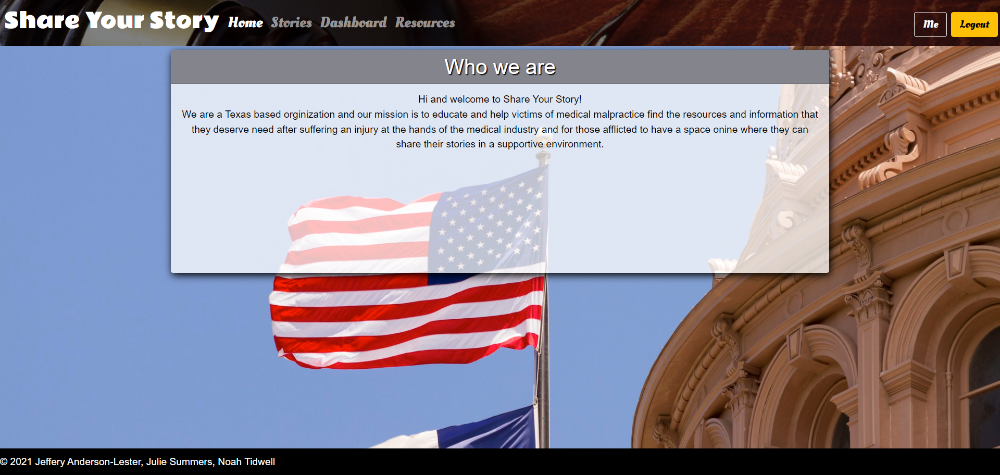
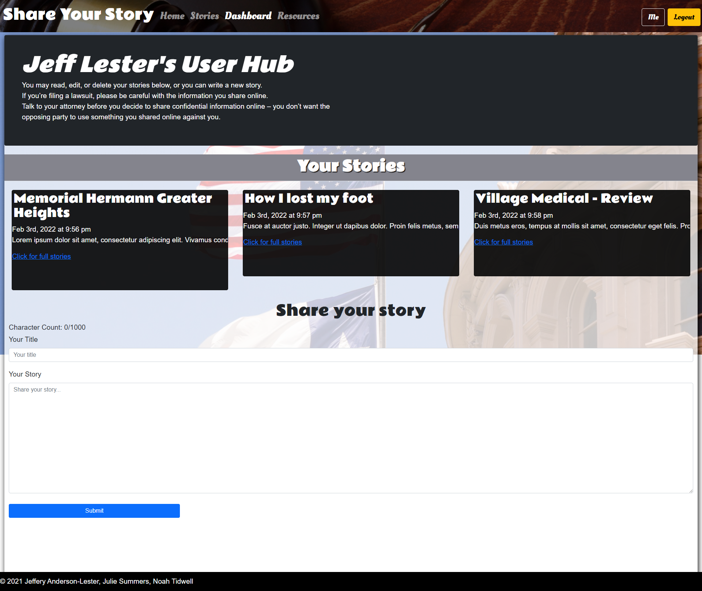
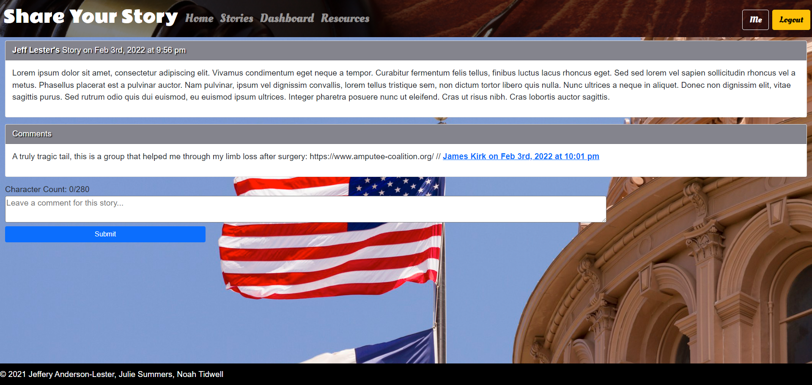

# share-your-story

## A React PWA for victims of medical malpractice to share their experiences and get help.

## Table of Contents

- [Installation](#installation)
- [Deployed Link](#deployed)
- [Usage](#usage)
- [Images](#images)
- [Contributions](#contributions)
- [Software](#software)
- [Questions](#questions)

## Installation

No installation is necessary - working app is live and deployed on Heroku. If user would like to work with the code locally, npm install in the command line should install all the dependencies as found in the package.jason file. Database is created in mongo db and all commands should work in the mongo db shell.

## Deployed

GitHub Repository : https://github.com/JeffGoji/share-your-story

## Usage

Medical errors account for as many as 251,000 deaths per year as well as permanent injuries to the survivors of medical malpractice Unfortunately the survivors are often not given a chance to speak about there experiences or are completely disregarded by society at large witha fair share of victim blaming occurring, or it is swept under the rug of the medical industry.
As a person who has already gone through this and having heard from others who have suffered life-long injuries from medical malpractice I can tell you it is a very serious and very overlooked problem in this country.
We aim to change that by giving the victims an outlet for them to give a documented account as to what happened as well as support them in the recovery process and give them a chance at justice and making their voices heard.

## Images

## Contributions

Made by Jeffrey Anderson-Lester, Julie Summers and Noah Tidwell

## Software

This app was created using javaScript, jsNode, express (and its various children) dotenv, MongoDb, Apollo Client, Graphql, Bcrypt, React, HTML, CSS. Heroku and Mongo Atlas used for deployment.

## Questions

- If you have any questions about the repo, open an issue or contact me directly at
- You can find more of our work at:
  ### [https://github.com/JeffGoji](https://github.com/JeffGoji)
  ### [https://github.com/Jsumme1](https://github.com/Jsumme1)
  ### [https://github.com/NoahTidwell](https://github.com/NoahTidwell)
